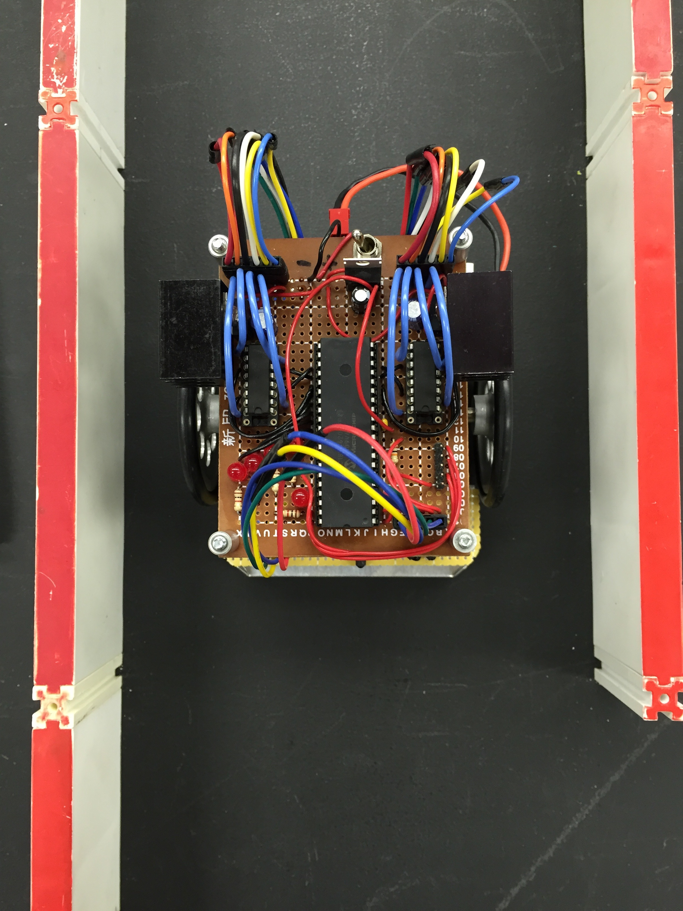

  

Asking questions is not only a way of getting information and learning but also an important way of communicating ideas and understanding. Smart questions are important because they help us get the specific answers we are looking for and also prevent any misunderstanding or miscommunication. 

Here is an example of an [ineffective question from StackOverflow.](http://stackoverflow.com/questions/36544950/cant-convert-from-void-to-bool-compile-error) First of all, the question does not post the error message. It does provide the information that the error is generated in Visual Studio but does not provide any further details. The poster assumes that the person answering the question has Visual Studio and that their version of Visual Studios and settings are the same. They also failed to communicate the things they've done so far to attempt to fix the problem. 

http://stackoverflow.com/questions/36544950/cant-convert-from-void-to-bool-compile-error

Here is an example of a [smart question also from StackOverflow.](http://stackoverflow.com/questions/8547778/why-is-one-loop-so-much-slower-than-two-loops) The asker is very specific in what development environment they are using, MS Visual C++ 10.0. They also run through their problem in chronologial order and provide code snippets for explanation. They also show their attempt at debugging the problem. The question is also written well and easy to understand because it uses proper English and is generally free of grammatical errors. 

http://stackoverflow.com/questions/8547778/why-is-one-loop-so-much-slower-than-two-loops

