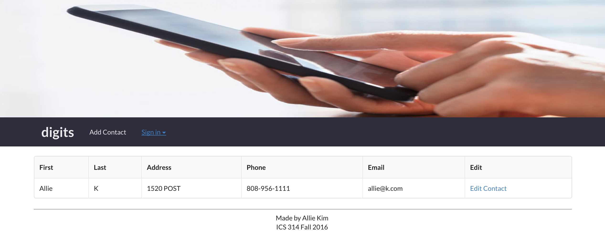

Learning Meteor didn't come with as steep a learning curve as I had anticipated when I thought of building my first web app.  Having templates and plenty of documentation, I was able to learn how to implement certain functionalities in my application fairly quickly. I felt like Meteor helped me understand the basic components of a web application without having to understand the nitty-gritty implementation details. 

Some challenges I encountered when learning Meteor were understanding what the multitude of files in the application were for and how they were organized. There is a lot of code associated with the application, of which, I would say I understand and actually worked on only a fraction of. I think it would be challenging to go through the rest of the code to try and implement a change in some of the other files that I'm not as familiar with. Another part of Meteor that I found challenging was debugging my application. For example, the error logs in the terminal didn't point me to an exact file location of my error when I attemped to import a file that didn't exist. So, in order to solve this error, I had to sort through the many files in my application. 

I have had some exposure to another web application developoment platform, Django. Going through the process of building a web application with Meteor was sort of an "aha! moment" for my past experiences with Django. I also found that I was already familiar with a lot of the tools and programming languages needed to build a Meteor application such as JavaScript, Underscore, SemanticUI and HTML. 

I was shocked that I could build a CRUD (create-update-read-delete) web application with little knowledge of backend programming. Overall, I'm excited to have the tools and knowledge to build a Meteor application!

