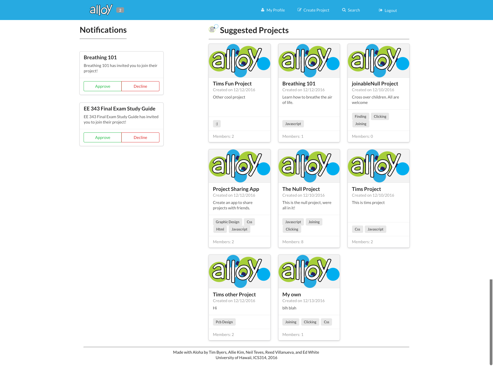

# Project Overview
I worked on a team of University of Hawaii computer science and computer engineering undergraduate students under the guidance of Professor Philip Johnson to build a web application, Alloy. [Click here](https://alloyteams.github.io/) to see the team's project page. 

the problem that the app seeks to solve is that it is often difficult for students interested in working on projects to find a team of people with the right set of skills. The idea behind Alloy was to create an application that helps UH students find teams. It allows students who either have a project idea or want to work on a side project to connect with potential team members based on skills necessary to complete the project. 

Some of the use cases include:
* Creating profiles that list skills
* Creating projects that other people can browse and join
* Suggesting relevant projects based on a user's skills
* Searching for people and projects based on skills

Below is a screen capture of the project home page which has a list of featured projects.

### Meteor Application Development
The application was built using the web application framework, Meteor. I was primarily responsible for designing the layout of pages. In order to create these pages, the team used HTML, Semantic UI, JavaScript and some CSS. Our team used Git and GitHub for version control to improve the efficiency with which we were able to test and develop code. I designed the layout for the landing page, user home page, user profile page, project profile page and the pages to edit profile information. On these pages, I also implemented the functionality to collect and store data from various input fields to our database.

### Learning Outcomes
From this project, I learned both technical and project management skills. On the technical side, I became familiar with the Meteor application framework and strengthened my understanding of HTML and JavaScript. I also strengthened my skills in using Git and GitHub for version control. In terms of project management, I learned how to effectively break down tasks within a project to smaller incremental steps which we referred to as issues. More specifically, I learned how to create, assign and manage issues for projects through GitHub. 
