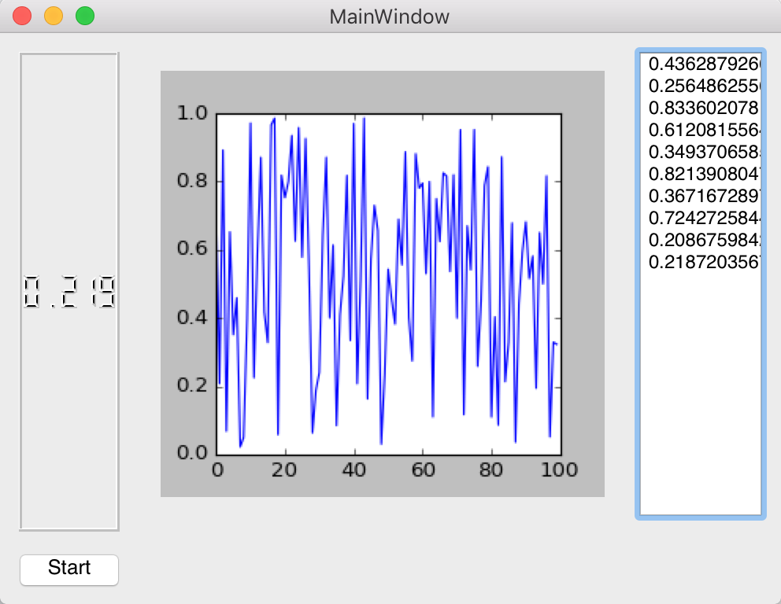

The goal of this project was to create an in-house, low-cost tool for members of the Smart Campus Energy Lab at the University of Hawaii at Manoa. We used an Arduino ATMega chip and INA219 DC current sensor to collect current and voltage data from devices being developed in the lab. 

As the software lead for the project, I developed a GUI to allow users to visualize current and voltage readings 

For more information on the Smart Campus Energy Lab, visit [this webpage](http://scel-hawaii.org/).

Source: <a href="https://github.com/alliekim13/GUI"><i class="large github icon"></i>GUI</a>
